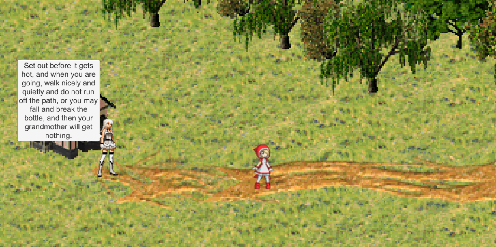
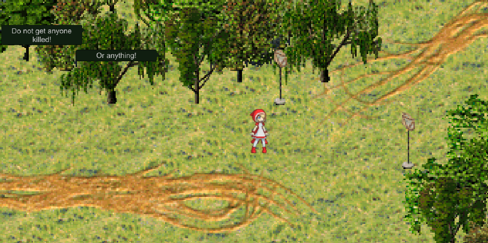
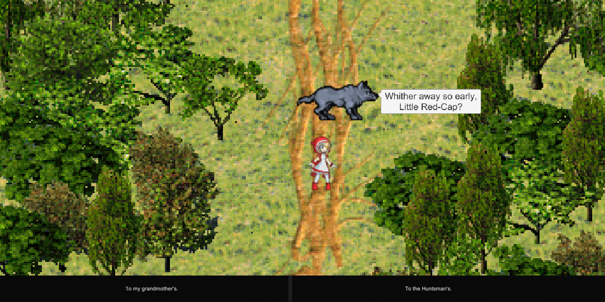
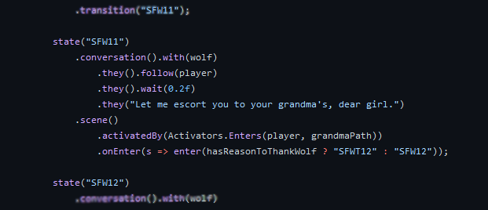

# Little Red Friendly Hood
A game in which the player, playing as Little Red-Cap, has to cross the woods and get to her grandmother.
She has to be friendly enough with the wolf so not to get eaten, but not too friendly.

## Screenshots

  

## Narrative script helpers
